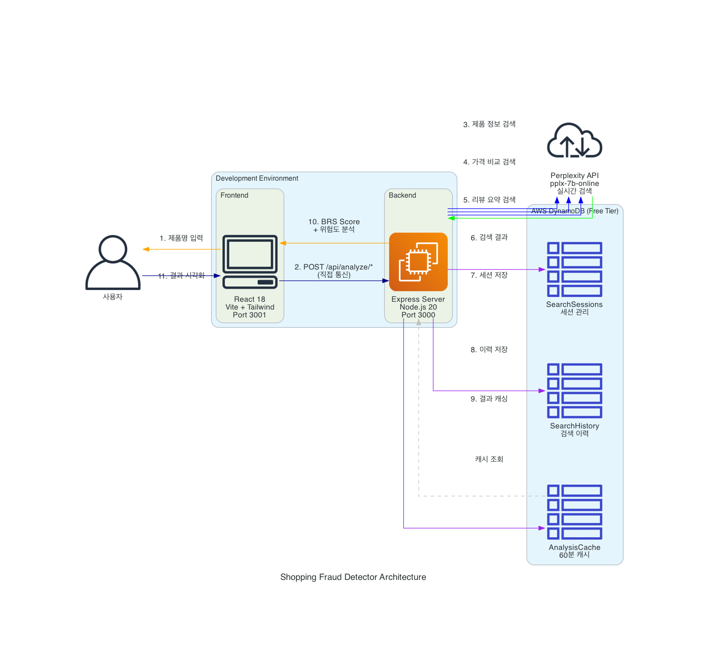

# 🛡️ 쇼핑 흑우 감별사

> AI 기반 온라인 쇼핑 사기 탐지 서비스

**제품명**을 입력하면 Perplexity Search API를 통해 가격, 리뷰, 판매 플랫폼 정보를 수집하여 사기 위험도를 평가하고, 안전한 쇼핑을 돕는 웹 애플리케이션입니다.

> ⚠️ **중요 변경사항**: 법적 이슈로 인해 직접 웹 크롤링을 중단하고, Perplexity Search API 기반으로 전환했습니다.

[](https://opensource.org/licenses/MIT)
[](https://nodejs.org/)
[](https://aws.amazon.com/)

## 📋 목차

- [주요 기능](#-주요-기능)
- [기술 스택](#-기술-스택)
- [아키텍처](#-아키텍처)
- [빠른 시작](#-빠른-시작)
- [로컬 개발](#-로컬-개발)
- [배포](#-배포)
- [프로젝트 구조](#-프로젝트-구조)
- [API 문서](#-api-문서)
- [테스트](#-테스트)
- [개발 도구](#️-개발-도구)
- [AI 코드 리뷰](#-ai-코드-리뷰)
- [기여하기](#-기여하기)
- [라이선스](#-라이선스)

## ✨ 주요 기능

### MVP (Phase 1) - Perplexity API 기반

- 🔍 **제품 정보 검색**: Perplexity Search API를 통한 제품명 기반 정보 수집
- 💰 **가격 비교 분석**: 여러 플랫폼(쿠팡, 네이버쇼핑, 11번가 등)의 가격 통계 및 이상치 탐지
- 🏪 **플랫폼 신뢰도**: 판매 플랫폼의 신뢰도 평가
- 📝 **리뷰 요약**: 긍정/부정 키워드 분석 및 감정 점수 계산
- 📊 **위험도 점수**: 0-100점 사기 위험도 점수 (가격 40%, 플랫폼 20%, 리뷰 40%)
- 💾 **검색 이력 저장**: DynamoDB를 통한 세션 및 검색 이력 관리

### Phase 2 (계획)

- 🤖 **AI 추천 코멘트**: 자연어 분석 결과 요약
- 📈 **리뷰 감정 지도**: 감정 분포 시각화
- 🚨 **위험 키워드 감지**: 사기성 키워드 하이라이트
- 📉 **리스크 타임라인**: 위험도 변화 추이

### Phase 3 (계획)

- ⚖️ **상품 비교**: 두 상품 동시 비교
- 📄 **PDF 리포트**: 분석 결과 다운로드
- 👥 **사용자 참여형 DB**: 커뮤니티 기반 사기 신고

## 🛠 기술 스택

### Backend

- **Runtime**: Node.js 20
- **Framework**: Express 4.x
- **Database**: AWS DynamoDB
- **Search API**: Perplexity AI (pplx-7b-online)
- **HTTP Client**: Axios
- **Logging**: Winston
- **Security**: Helmet, express-rate-limit

### Frontend

- **Framework**: React 18
- **Styling**: Tailwind CSS
- **HTTP Client**: Axios
- **Charts**: Chart.js (Phase 2)

### DevOps & Infrastructure

- **Monorepo**: Yarn Workspaces
- **IaC**: Terraform
- **Container**: Docker, Docker Compose
- **Deployment**: AWS Lightsail (수동 배포)
- **Reverse Proxy**: Nginx
- **Process Manager**: PM2
- **Monitoring**: CloudWatch (AWS)
- **Git Hooks**: Husky, lint-staged

## 🏗 아키텍처



### 배포 구성

- **AWS Lightsail** ($5/월): 단일 서버 (Nginx + Node.js + Express)
- **AWS DynamoDB** (무료 티어): NoSQL 데이터베이스
- **AI 프로바이더** (선택 가능):
  - Claude API (개발 및 프로덕션 권장)
  - AWS Bedrock (프로덕션 대안)

### 비용

- **MVP**: $7-9/월
- **Phase 2**: $8-11/월
- **Phase 3**: $8-12/월

## 🚀 빠른 시작

### 사전 요구사항

- Node.js 20+
- Docker & Docker Compose (로컬 개발 시)
- AWS 계정 (프로덕션 배포 시)
- Claude API Key (권장)

### 설치

```bash
# 1. 저장소 클론
git clone https://github.com/your-repo/shopping-fraud-detector.git
cd shopping-fraud-detector

# 2. 의존성 설치
yarn install

# 3. Git Hooks 설정 (Husky)
yarn prepare

# 4. 환경 변수 설정
cp .env.example .env.local
nano .env.local

# 5. Docker 서비스 시작 (DynamoDB)
docker-compose -f docker-compose.local.yml up -d

# 6. 로컬 환경 설정 (DynamoDB 테이블 생성)
yarn setup:dynamodb

# 7. 개발 서버 시작
yarn dev

# 8. DynamoDB ADMIN 접속
http://localhost:8001
```

### 환경 변수 설정

```bash
# .env.local
NODE_ENV=development
PORT=3000
CLIENT_PORT=3001

# Perplexity API (필수)
PERPLEXITY_API_KEY=pplx-your-api-key-here
PERPLEXITY_MODEL=pplx-7b-online

# AWS Settings
AWS_REGION=ap-northeast-2

# DynamoDB (로컬 개발 시)
DYNAMODB_ENDPOINT=http://localhost:8000
DYNAMODB_TABLE_SESSIONS=BlackCow_SearchSessions
DYNAMODB_TABLE_HISTORY=BlackCow_SearchHistory
DYNAMODB_TABLE_CACHE=BlackCow_AnalysisCache
```

### 주요 변경사항 및 제한사항

**변경사항:**

- ❌ 직접 웹 크롤링 제거 (법적 이슈)
- ✅ Perplexity Search API 기반 정보 수집
- ✅ 제품명 입력 방식 (URL → 제품명)
- ✅ DynamoDB 세션 및 이력 관리
- ✅ 캐시 기능 (60분)

**제한사항:**

- 📌 URL이 아닌 **제품명**을 입력받음 (예: "아이폰 15 Pro", "닌텐도 스위치2")
- 📌 실시간 크롤링이 아닌 **검색 결과 기반 분석**
- 📌 정확도는 Perplexity의 검색 품질에 의존
- 📌 가격 정보는 검색 결과에서 추출한 근사값
- 📌 리뷰 분석은 키워드 기반 간단한 감정 분석

## 💻 로컬 개발

### Perplexity API 설정

```bash
# 1. API Key 발급: https://www.perplexity.ai/settings/api
# 2. .env.local 설정
PERPLEXITY_API_KEY=pplx-xxx
PERPLEXITY_MODEL=pplx-7b-online

# 3. 개발 서버 시작
yarn dev
```

**장점**:

- 실시간 검색 기반 정보 수집
- 법적 이슈 없음 (크롤링 대신 검색 API 사용)
- 빠른 응답 속도

**비용**:

- 신규 가입 시 무료 크레딧 제공
- 이후 사용량 기반 과금 (검색당 약 $0.001-0.01)

**권장 모델**: `pplx-7b-online` (실시간 검색 지원)

### 협업 개발

여러 개발자가 독립적으로 작업할 수 있도록 포트를 다르게 설정하세요:

```bash
# 개발자 1
PORT=3000
CLIENT_PORT=3001
DYNAMODB_PORT=8000

# 개발자 2
PORT=3010
CLIENT_PORT=3011
DYNAMODB_PORT=8010

# 개발자 3
PORT=3020
CLIENT_PORT=3021
DYNAMODB_PORT=8020
```

## 🚢 배포

프로젝트는 다양한 배포 방법을 지원합니다.

### Option 1: Docker (권장)

```bash
# 전체 스택 실행
cd infra/docker
docker-compose up -d

# 상태 확인
docker-compose ps

# 로그 확인
docker-compose logs -f
```

### Option 2: Terraform (IaC)

```bash
cd infra/terraform

# 1. 변수 파일 설정
cp terraform.tfvars.example terraform.tfvars
# terraform.tfvars 편집 (Claude API Key 등)

# 2. 초기화 및 배포
terraform init
terraform plan
terraform apply

# 3. 출력 확인
terraform output
```

상세 가이드: [infra/terraform/README.md](./infra/terraform/README.md)

### Option 3: AWS Lightsail (수동)

```bash
# 1. 인스턴스 생성 및 설정
./infra/lightsail/setup.sh

# 2. 애플리케이션 배포
./infra/lightsail/deploy-to-lightsail.sh
```

### GitHub Actions (CI)

Pull Request 생성 시 자동으로 코드 검증이 실행됩니다.

**검증 항목:**

- ESLint 린트 검사
- Prettier 포맷 체크
- TypeScript 타입 체크
- 테스트 실행
- 빌드 성공 여부

워크플로우 파일: [.github/workflows/ci.yml](.github/workflows/ci.yml)

**배포**: Terraform 스크립트 또는 수동 배포 스크립트 사용

## 📁 프로젝트 구조

```
shopping-fraud-detector/
├── .claude/                      # Claude Code 설정
│   ├── agents/                   # 특화 에이전트 프롬프트
│   │   ├── backend-developer.md
│   │   ├── frontend-developer.md
│   │   └── code-reviewer.md
│   ├── settings.local.json
│   └── settings.md               # 프로젝트 설정
│
├── .github/                      # GitHub 설정
│   ├── workflows/                # CI/CD 워크플로우
│   │   ├── code-review.yml       # AI 코드 리뷰
│   │   └── deploy.yml            # 자동 배포
│   ├── ISSUE_TEMPLATE/           # Issue 템플릿
│   │   ├── bug_report.md
│   │   └── feature_request.md
│   └── pull_request_template.md  # PR 템플릿
│
├── .husky/                       # Git Hooks
│   ├── pre-commit                # 커밋 전 린트/포맷
│   ├── commit-msg                # 커밋 메시지 검증
│   └── README.md
│
├── apps/                         # 애플리케이션
│   ├── client/                   # React 프론트엔드
│   │   ├── src/
│   │   │   ├── components/       # UI 컴포넌트
│   │   │   ├── pages/            # 페이지
│   │   │   └── services/         # API 클라이언트
│   │   └── package.json
│   │
│   └── server/                   # Express 백엔드
│       ├── src/
│       │   ├── routes/           # API 라우트
│       │   ├── services/         # 비즈니스 로직
│       │   ├── models/           # 데이터 모델
│       │   ├── db/               # DynamoDB 클라이언트
│       │   └── middleware/       # 미들웨어
│       └── package.json
│
├── packages/                     # 공유 패키지
│   └── shared/                   # 공통 타입 및 유틸리티
│
├── scripts/                      # 유틸리티 스크립트
│   ├── deploy.sh                 # 배포 스크립트
│   ├── setup-db.sh               # DynamoDB 초기화
│   ├── health-check.sh           # 헬스체크
│   └── backup.sh                 # 백업
│
├── infra/                        # 인프라 코드 (IaC)
│   ├── docker/                   # Docker 설정
│   │   ├── Dockerfile.client
│   │   ├── Dockerfile.server
│   │   ├── nginx.conf
│   │   └── docker-compose.yml
│   ├── terraform/                # Terraform IaC
│   │   ├── main.tf
│   │   ├── variables.tf
│   │   ├── outputs.tf
│   │   └── README.md
│   └── lightsail/                # AWS Lightsail 설정
│       ├── setup.sh
│       └── deploy-to-lightsail.sh
│
├── docs/                         # 문서
│   └── CODE_REVIEW_SETUP.md
│
├── .editorconfig                 # 에디터 설정
├── .eslintrc.js                  # ESLint 설정
├── .prettierrc                   # Prettier 설정
├── .lintstagedrc.json            # lint-staged 설정
├── tsconfig.json                 # TypeScript 설정
├── .gitignore
├── .dockerignore
│
├── CLAUDE.md                     # 프로젝트 가이드 (상세)
├── CONTRIBUTING.md               # 기여 가이드
├── README.md                     # 프로젝트 개요
├── package.json                  # 루트 패키지 설정 (Yarn Workspaces)
└── docker-compose.local.yml      # 로컬 개발 환경
```

자세한 내용은 [CLAUDE.md](./CLAUDE.md)를 참조하세요.

## 📚 API 문서

### POST /api/analyze/product

제품 기본 정보를 검색합니다.

**Request:**

```json
{
  "productName": "아이폰 15 Pro",
  "sessionId": "optional-session-id"
}
```

**Response:**

```json
{
  "sessionId": "uuid-v4",
  "productName": "아이폰 15 Pro",
  "summary": {
    "productName": "아이폰 15 Pro",
    "averagePrice": 1500000,
    "priceRange": { "min": 1400000, "max": 1600000 },
    "popularPlatforms": ["쿠팡", "네이버쇼핑"],
    "description": "애플의 최신 플래그십 스마트폰...",
    "keyFeatures": ["A17 Pro 칩", "티타늄 디자인", "..."],
    "searchedAt": "2025-11-13T12:00:00Z"
  },
  "processingTime": 3500
}
```

### POST /api/analyze/price

가격 비교 정보를 검색합니다.

**Request:**

```json
{
  "productName": "아이폰 15 Pro",
  "sessionId": "optional-session-id"
}
```

**Response:**

```json
{
  "sessionId": "uuid-v4",
  "productName": "아이폰 15 Pro",
  "priceComparison": {
    "productName": "아이폰 15 Pro",
    "prices": [
      {
        "platform": "쿠팡",
        "price": 1450000,
        "url": "https://...",
        "lastUpdated": "2025-11-13"
      }
    ],
    "statistics": {
      "average": 1500000,
      "median": 1490000,
      "min": 1400000,
      "max": 1600000,
      "stdDev": 50000
    },
    "outliers": []
  },
  "processingTime": 4200
}
```

### POST /api/analyze/reviews

리뷰 요약 정보를 검색합니다.

**Request:**

```json
{
  "productName": "아이폰 15 Pro",
  "sessionId": "optional-session-id"
}
```

**Response:**

```json
{
  "sessionId": "uuid-v4",
  "productName": "아이폰 15 Pro",
  "reviewDigest": {
    "productName": "아이폰 15 Pro",
    "overallSentiment": "positive",
    "sentimentScore": 75,
    "commonPraises": ["카메라 성능이 좋음", "배터리 오래감"],
    "commonComplaints": ["가격이 비쌈"],
    "keyInsights": ["전반적으로 만족도가 높음"]
  },
  "processingTime": 3800
}
```

### POST /api/analyze/score

종합 위험도 점수를 계산합니다 (제품 정보, 가격, 리뷰를 모두 분석).

**Request:**

```json
{
  "productName": "아이폰 15 Pro",
  "sessionId": "optional-session-id",
  "useCache": true
}
```

**Response:**

```json
{
  "sessionId": "uuid-v4",
  "productName": "아이폰 15 Pro",
  "summary": { ... },
  "priceComparison": { ... },
  "reviewDigest": { ... },
  "riskScore": {
    "score": 25,
    "level": "LOW",
    "factors": [
      {
        "category": "PRICE",
        "severity": "LOW",
        "description": "가격이 안정적입니다.",
        "impact": 20
      },
      {
        "category": "PLATFORM",
        "severity": "LOW",
        "description": "신뢰할 수 있는 플랫폼에서 판매 중입니다.",
        "impact": 10
      },
      {
        "category": "REVIEW",
        "severity": "LOW",
        "description": "사용자 리뷰가 대체로 긍정적입니다.",
        "impact": 10
      }
    ],
    "recommendation": "✅ 안전한 제품으로 보입니다. 자신있게 구매하세요!"
  },
  "analyzedAt": "2025-11-13T12:00:00Z",
  "processingTime": 12500,
  "fromCache": false
}
```

### GET /api/analyze/session/:sessionId

세션 정보 및 검색 이력을 조회합니다.

**Response:**

```json
{
  "session": {
    "sessionId": "uuid-v4",
    "productName": "아이폰 15 Pro",
    "createdAt": "2025-11-13T12:00:00Z",
    "updatedAt": "2025-11-13T12:05:00Z",
    "analysisResult": { ... }
  },
  "history": [
    {
      "historyId": "uuid-v4",
      "sessionId": "uuid-v4",
      "productName": "아이폰 15 Pro",
      "searchType": "product",
      "query": "아이폰 15 Pro",
      "results": { ... },
      "createdAt": "2025-11-13T12:00:00Z"
    }
  ]
}
```

## 🧪 테스트

```bash
# 단위 테스트
yarn test

# 통합 테스트
yarn test:integration

# E2E 테스트
yarn test:e2e

# 커버리지
yarn test:coverage
```

## 🛠️ 개발 도구

### Git Hooks (Husky)

프로젝트는 Husky를 사용하여 Git Hooks를 관리합니다.

**Pre-commit Hook**

- ESLint로 코드 검사 및 자동 수정
- Prettier로 코드 포맷팅
- 변경된 파일만 검사 (lint-staged)

**Commit-msg Hook**

- Conventional Commits 형식 검증
- 올바른 형식: `<type>(<scope>): <description>`

```bash
# Hook 건너뛰기 (비상시만 사용)
git commit -m "message" --no-verify
```

### EditorConfig

모든 개발자가 동일한 에디터 설정을 사용하도록 `.editorconfig`를 제공합니다.

- 들여쓰기: 2칸 (space)
- 줄바꿈: LF
- 인코딩: UTF-8
- 파일 끝 빈 줄: 추가

VS Code 사용자는 **EditorConfig for VS Code** 확장을 설치하세요.

### 유용한 명령어

```bash
# 린트 검사
yarn lint

# 린트 자동 수정
yarn lint:fix

# 타입 체크
yarn type-check

# 코드 포맷팅
yarn format

# 포맷 검사
yarn format:check

# 전체 빌드
yarn build

# 캐시 정리
yarn clean
```

### 스크립트 실행

```bash
# 배포
./scripts/deploy.sh

# 헬스체크
./scripts/health-check.sh

# 백업
./scripts/backup.sh

# DynamoDB 초기화
./scripts/setup-db.sh
```

## 🤖 AI 코드 리뷰

이 프로젝트는 GitHub Actions를 통한 자동 AI 코드 리뷰를 지원합니다.

> 📖 **상세 가이드**: [docs/CODE_REVIEW_SETUP.md](docs/CODE_REVIEW_SETUP.md)에서 전체 설정 방법과 고급 기능을 확인하세요.

### 설정 방법

1. **GitHub Repository Settings > Secrets and variables > Actions로 이동**

2. **`ANTHROPIC_API_KEY` Secret 추가**
   - [Anthropic Console](https://console.anthropic.com)에서 API Key 발급
   - Repository Secret으로 추가: `ANTHROPIC_API_KEY=sk-ant-api03-xxx`

3. **Pull Request 생성 시 자동 실행**
   - PR을 생성하거나 업데이트하면 자동으로 AI 코드 리뷰가 실행됩니다
   - 코드 변경사항을 분석하여 리뷰 코멘트를 자동으로 달아줍니다

### 리뷰 항목

AI 코드 리뷰는 다음 항목들을 자동으로 검사합니다:

- 🐛 **버그 & 에러**: 로직 에러, 런타임 에러 가능성, 엣지 케이스
- 🔒 **보안**: SQL Injection, XSS, 인증 문제 등 보안 취약점
- 🎯 **베스트 프랙티스**: 코드 스타일, 네이밍 컨벤션, 디자인 패턴
- ⚡ **성능**: 비효율적인 코드, 최적화 기회
- 🧪 **테스트**: 누락된 테스트 케이스
- 📖 **가독성**: 코드 명확성, 주석, 문서화

### 워크플로우 상세

- **트리거**: PR 생성, 업데이트, 재오픈
- **대상 파일**: `.js`, `.jsx`, `.ts`, `.tsx`, `.py`, `.java`, `.go`, `.rs`, `.rb`, `.php`
- **AI 모델**: Claude Sonnet 4.5
- **비용**: 파일당 약 $0.01-0.05 (토큰 사용량에 따라 변동)

### 워크플로우 비활성화

AI 코드 리뷰를 일시적으로 비활성화하려면:

```bash
# .github/workflows/code-review.yml 파일 삭제 또는
git mv .github/workflows/code-review.yml .github/workflows/code-review.yml.disabled
```

## 🤝 기여하기

기여를 환영합니다! 🎉

> 📖 **상세 가이드**: [CONTRIBUTING.md](./CONTRIBUTING.md)에서 전체 기여 프로세스와 코딩 가이드라인을 확인하세요.

### 빠른 시작

```bash
# 1. 저장소 포크 및 클론
git clone https://github.com/YOUR_USERNAME/shopping-fraud-detector.git
cd shopping-fraud-detector

# 2. 의존성 설치 및 Git Hooks 설정
yarn install
yarn prepare

# 3. 기능 브랜치 생성
git checkout -b feature/your-feature

# 4. 개발 및 테스트
yarn dev
yarn test

# 5. 커밋 (Conventional Commits 형식)
git commit -m "feat(client): add amazing feature"

# 6. 푸시 및 PR 생성
git push origin feature/your-feature
```

### 주요 규칙

- ✅ **Conventional Commits** 형식 필수
- ✅ **ESLint** 및 **Prettier** 규칙 준수 (자동 검사)
- ✅ **타입 안전성**: TypeScript strict 모드
- ✅ **테스트 통과** 필수
- ✅ **코드 리뷰** 승인 후 머지

더 자세한 내용은 [CONTRIBUTING.md](./CONTRIBUTING.md)를 참조하세요.

## 📄 라이선스

This project is licensed under the MIT License - see the [LICENSE](LICENSE) file for details.

## 👥 팀

- **개발자 1**: 크롤링 및 가격 분석
- **개발자 2**: 판매자 분석 및 리뷰 분석
- **개발자 3**: AI 통합 및 프론트엔드

## 📞 문의

프로젝트 관련 문의사항이 있으시면 이슈를 등록해주세요.

- GitHub Issues: [https://github.com/your-repo/shopping-fraud-detector/issues](https://github.com/your-repo/shopping-fraud-detector/issues)

## 🙏 감사의 말

- [Perplexity AI](https://www.perplexity.ai/) - Search API 제공
- [AWS](https://aws.amazon.com/) - DynamoDB 및 인프라
- [React](https://react.dev/) - UI 프레임워크
- [Express](https://expressjs.com/) - 백엔드 프레임워크

---

⭐ 이 프로젝트가 도움이 되셨다면 Star를 눌러주세요!
